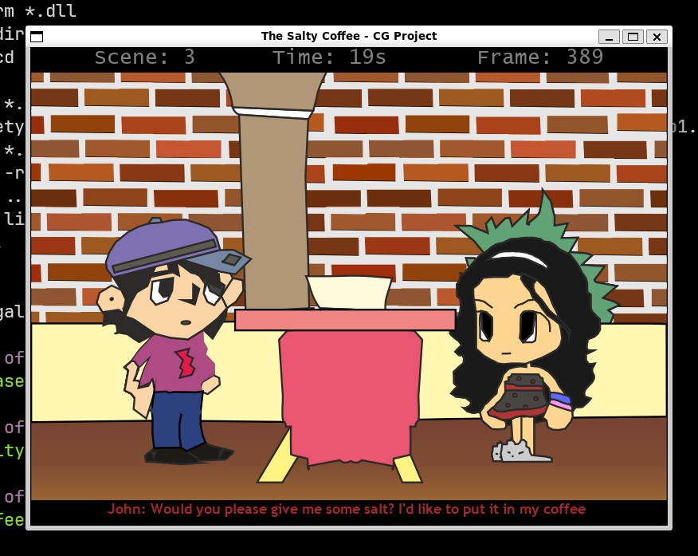

# The salty coffee

An SDL/C++ project I worked on as part of a college CIA (Cumulative Internal Assessment) assignment. 

I found its source code in my Google Drive account. I'm not really proud of the code -- it's full of glaring mistakes. And the story is cringe. But I still wanted to get it working, just because.



## Building the project

The following instructions were tested on Ubuntu 22.04

1. Install SDL 1.2 development files:
	```sh
	sudo apt install \
		libsdl1.2-dev \
		libsdl-image1.2-dev \
		libsdl-mixer1.2-dev \
		libsdl-ttf2.0-dev
	```
2. Install `cmake`:
	```sh
	sudo apt install cmake
	```
3. Build the app:
	```sh
	cmake .
	make
	```
4. Run the app:
	```sh
	cd ./bin
	./salty-coffee
	```
